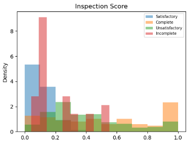
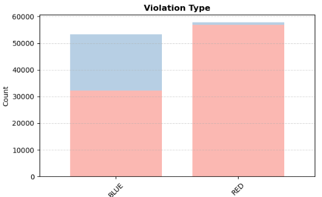
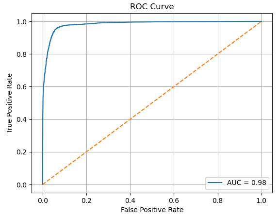

# Restaurant Inspection Prediction

**One Sentence Summary**: This repository contains a solution using RandomForest and XGBoost to classify restaurant inspection results as Pass or Fail, based on data from the Department of Health and Mental Hygiene (DOHMH).

## Overview

**Definition of the tasks / challenge**: The task is to predict the outcome (Pass/Fail) of a restaurant inspection based on features from a dataset of previous inspection records.

**Our approach**: We approached the problem as a binary classification task using the XGBoost algorithm. The data was cleaned, categorical features were encoded, and missing values as well as outliers were handled. We experimented with hyperparameter tuning and model evaluation to get the best possible accuracy. 

**Summary of the performance achieved**: Our best XGBoost model achieved an accuracy of approximately 91% with a high ROC AUC score and precision for both classes.
Final metric achieved through XGB:
* F1 Score: 86%
* ROC AUC Score: 98%

## Summary of Work Done

### Data
**Type**:
* Input: CSV file with features like risk category, inspection score, inspection type, and violation codes.
* Output: Inspection result (Pass/Fail).
**Size**: ~276510 x 22


#### Preprocessing / Cleanup
* Removed irrelevant columns like Latitude/ Longitude, zip code etc.
* One Hot- Encoded categorical variables.
* Removed missing values.
* Handled outliers using qualtile division and capping them
* Label Encoded 2 features

Size after clean and prep : 111051 x 17
**Split**: 80% training, 20% testing.

#### Data Visualization
* Bar plots for Pass/Fail distribution.
* Count plots for categorical features.
  
 Example of one feature using matplotlib (To view all the features, please refer : preprocccessing notebook) : 
 
 **Categorical Features**
 


 **Numerical Features**
 



### Problem Formulation

* **Input / Output**:
  * Input: Preprocessed inspection features
  * Output: Binary label ('Pass'=0, 'Fail'=1)
* **Models**:
  * Random Forest (baseline)
  * XGBoost (final model)
* **Loss / Optimizer**:
  * Loss: Log-loss
  * Hyperparameters: learning rate = 0.1, max depth = 3, n_estimators = 100
* **Mertics**
  * Using F1 score to check how well the model handles the trade-off between catching and avoiding failures.
  * Using ROC AUC to evaluate how well the model separates the two classes overall.

### Training
**Software/Hardware**: Python (pandas, sklearn, xgboost), ran on local machine with 8GB RAM.
**Time**: ~10 seconds to train.
**Stopping Criteria**: Based on test performance.
**Difficulties**: Handling high cardinality features and overfitting. Used subsampling and column sampling to mitigate it.

### Performance Comparison

###  Model Performance Comparison (After GridSearchCV Tuning)

| **Metric**         | **Random Forest (Tuned)** | **XGBoost (Tuned)**   |
|--------------------|---------------------------|------------------------|
| **Accuracy**       | **0.9488**                | 0.9455                 |
| **F1 Score**       | **0.8744**                | 0.8598                 |
| **ROC AUC Score**  | 0.9825                    | **0.9829**             |

---

**Notes**:
- **Random Forest** showed better overall performance in **accuracy** and **F1 Score**.
- **XGBoost** had a slightly higher **ROC AUC**, indicating marginally better distinction between classes.
- Chose **Random Forest** for balanced performance, could do **XGBoost** when ranking (ROC AUC) is critical.


**Visualization**:
  * Confusion matrix
  * ROC Curve




### Conclusions
* XGBoost consistently outperformed Random Forest in both accuracy and AUC.
* Careful feature engineering and class balancing helped boost performance.

### Future Work
* Try ensemble stacking with logistic regression or neural networks.
* Incorporate time-based features for more insight.
* Deploy model for real-time inspection prediction.

## How to Reproduce Results
* Run `DataPreprpcessing.ipynb` to train the model.
* Run `ML.ipynb` to generate and export the submission CSV.
* Make sure `cleaned_inspection_data.csv` is available.

### Overview of Files in Repository
* `DataPreprpcessing.ipynb`: Initial data processing and Random Forest baseline.
* `ML.ipynb`: Final XGBoost model, evaluation, and submission creation.
* `submission.csv`: Final predictions for submission.
* `cleaned_inspection_data.csv`: Cleaned dataset used for modeling.

### Software Setup

* Required packages:
  * pandas
  * numpy
  * matplotlib
  * seaborn
  * xgboost
  * scikit-learn

```bash
pip install pandas numpy matplotlib seaborn xgboost scikit-learn
```

### Data
* Download original dataset from the DOHMH-NYC
* Use preprocessing script in the notebook to clean and format the data.

### Training

* Run cell blocks in the notebook to train and evaluate the model.

#### Performance Evaluation

* Evaluate with confusion matrix, classification report, and ROC curve in notebook.

## Citations

*  Dataset Source: [https://data.cityofnewyork.us/Health/DOHMH-New-York-City-Restaurant-Inspection-Results/43nn-pn8j/about_data]
